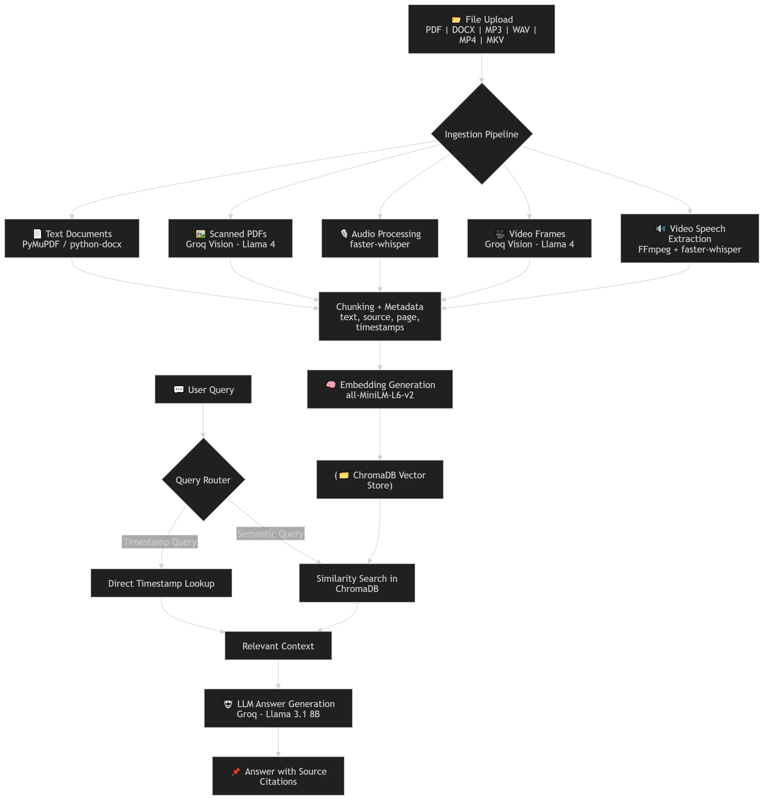

---
🚀 **Live Demo**: https://huggingface.co/spaces/mshreyansh452/anychat-ai
---

# 🧠 AnyChat AI — Multimodal RAG Chatbot

> Chat with **any document, audio, or video** using natural language. Get answers with exact page numbers and timestamps.

[](https://huggingface.co/spaces/mshreyansh452/anychat-ai)
[](https://python.org)
[](https://gradio.app)
[](LICENSE)

---

## 🎯 What it does

Upload any file — a research paper, a podcast, a lecture video — and have a conversation with it. Ask questions in plain English and get answers that cite exactly where the information came from.

**"What is discussed at 2:34 in the video?"** → answers with timestamp  
**"Summarize page 5 of the PDF?"** → answers with page number  
**"What are the key challenges mentioned?"** → answers from all sources combined  

---

## ✨ Features

| Feature | Description |
|---|---|
| 📄 **Text PDF** | Fast extraction with PyMuPDF |
| 🖼️ **Scanned PDF** | Auto-detected, read via Groq Vision AI |
| 🎵 **Audio** | Full transcription with word-level timestamps |
| 🎥 **Video** | Speech transcript + visual scene understanding |
| ⏱️ **Timestamp search** | "what happens at 1:38?" — finds exact moment |
| 🔍 **Semantic search** | Meaning-based retrieval, not just keywords |
| 📎 **Source citations** | Every answer cites file, page, or timestamp |
| 🗑️ **Session management** | Clear and re-index anytime |

---

## 🏗️ Architecture

<p align="center">
  
</p>


## 🛠️ Tech Stack

| Layer | Technology | Why |
|---|---|---|
| **Ingestion** | PyMuPDF, python-docx | Fast local text extraction |
| **OCR / Vision** | Groq Vision (Llama 4 Scout) | Reads scanned pages + video frames |
| **Transcription** | faster-whisper (base) | Word-level timestamps, runs locally |
| **Embeddings** | all-MiniLM-L6-v2 | 80MB, fast, free, no API needed |
| **Vector Store** | ChromaDB | Local persistence, zero config |
| **LLM** | Groq Llama 3.1 8B | Free tier, low latency |
| **UI** | Gradio 6.x | Rapid ML interface |
| **Deployment** | Hugging Face Spaces | Free hosting, public URL |

**Total infrastructure cost: $0**

---

## 🚀 Run Locally

```bash
# clone
git clone https://github.com/YOUR_USERNAME/anychat-ai
cd anychat-ai

# setup
python -m venv venv
venv\Scripts\activate        # Windows
source venv/bin/activate     # Mac/Linux

# install
pip install -r requirements.txt

# add API key
echo GROQ_API_KEY=your_key_here > .env

# run
python app.py
```

Get a free Groq API key at https://console.groq.com

---

## 📁 Project Structure

```bash
anychat-ai/
├── ingestion/
│   └── ingestor.py         # PDF, DOCX, audio, video parsers
├── vectorstore/
│   └── store.py            # ChromaDB wrapper + embedding logic
├── retrieval/
│   └── rag.py              # Query routing + LLM answer generation
├── ui/
│   └── app.py              # Gradio interface
├── app.py                  # HF Spaces entry point
├── requirements.txt        # Python dependencies
└── packages.txt            # Linux system dependencies
```

## 💡 Design Decisions

**Why faster-whisper over openai-whisper?** 4x faster, lower RAM, Python 3.12 compatible, same accuracy.

**Why ChromaDB over Pinecone/Qdrant?** Zero cost, zero config, runs entirely local — perfect for a project of this scale. Easy to swap for Qdrant cloud when needed.

**Why Groq over OpenAI?** Free tier is significantly more generous (1M tokens/min on Flash). Low latency inference on Llama models.

**Why dual search (semantic + timestamp)?** Pure semantic search can't find "what happens at 1:38" — embedding similarity between a timestamp string and transcript text is near zero. Timestamp queries need direct metadata filtering.

---

## 🔮 Roadmap

- [ ] Add YouTube URL ingestion support
- [ ] Multi-turn conversation memory
- [ ] Per-user/session isolated vector databases
- [ ] Cross-encoder reranking for better retrieval accuracy
- [ ] Semantic chunking instead of fixed-size chunking
- [ ] Speaker diarization for multi-speaker audio/video
- [ ] Streaming responses for better UX
- [ ] OCR fallback for low-quality scanned documents

---


## 👤 Author

Built by Shreyansh Mishra  
[LinkedIn](https://www.linkedin.com/in/shreyansh452/) · [GitHub](https://github.com/Shreyansh452) · [YouTube](https://youtu.be/bdTHCKoRnQM?si=6RFSyfnfZlfi0laq)
